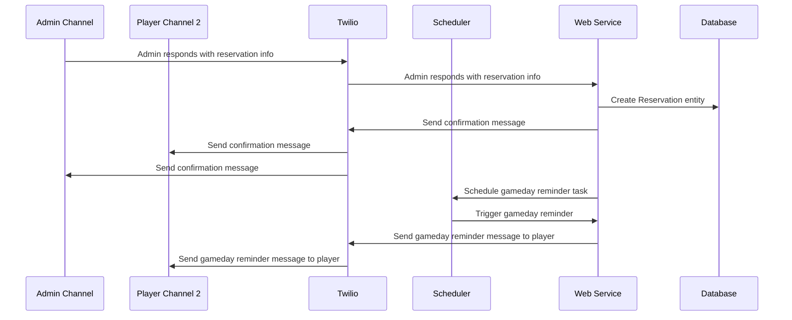

```mermaid
sequenceDiagram
    participant Admin Channel
    participant Player Channel 2
    participant Twilio
    participant Scheduler
    participant Web Service
    participant Database

    Admin Channel->>Twilio: Admin responds with reservation info
    Twilio->>Web Service: Admin responds with reservation info
    Web Service->>Database: Create Reservation entity
    Web Service->> Twilio: Send confirmation message
    Twilio->>Player Channel 2: Send confirmation message
    Twilio ->> Admin Channel: Send confirmation message
    Web Service ->> Scheduler: Schedule gameday reminder task
    Scheduler->>Web Service: Trigger gameday reminder
    Web Service->>Twilio: Send gameday reminder message to player
    Twilio->>Player Channel 2: Send gameday reminder message to player
```