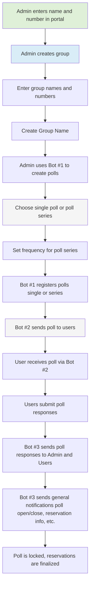

```mermaid
flowchart TD
    A[Admin enters name and number in portal] --> B[Admin creates group]
    B --> C[Enter group names and numbers]
    C --> D[Create Group Name]

    D --> E[Admin uses Bot #1 to create polls]
    E --> F[Choose single poll or poll series]
    F --> G[Set frequency for poll series]

    G --> H[Bot #1 registers polls single or series]

    H --> I[Bot #2 sends poll to users]
    I --> J[User receives poll via Bot #2]

    J --> K[Users submit poll responses]
    K --> L[Bot #3 sends poll responses to Admin and Users]

    L --> M[Bot #3 sends general notifications poll open/close, reservation info, etc.]

    M --> N[Poll is locked, reservations are finalized]

    style A fill:#dff0d8
    style B fill:#d9edf7
    style F fill:#f5f5f5
    style I fill:#f5f5f5
```
