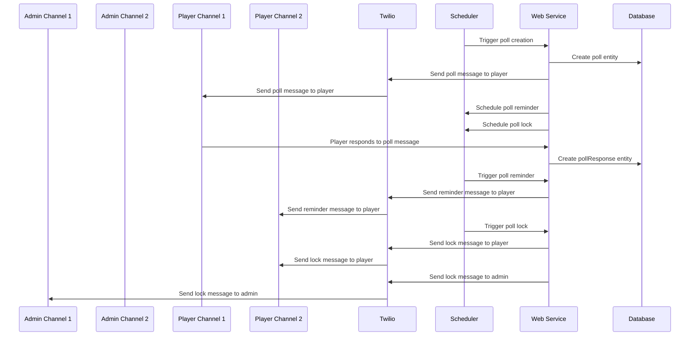

```mermaid
sequenceDiagram
    participant Admin Channel 1
    participant Admin Channel 2
    participant Player Channel 1
    participant Player Channel 2
    participant Twilio
    participant Scheduler
    participant Web Service
    participant Database
    
    Scheduler ->> Web Service: Trigger poll creation
    Web Service ->> Database: Create poll entity
    Web Service ->> Twilio: Send poll message to player
    Twilio ->> Player Channel 1: Send poll message to player
    Web Service ->> Scheduler: Schedule poll reminder
    Web Service ->> Scheduler: Schedule poll lock
    Player Channel 1 ->> Web Service: Player responds to poll message
    Web Service ->> Database: Create pollResponse entity
    Scheduler ->> Web Service: Trigger poll reminder
    Web Service ->> Twilio: Send reminder message to player
    Twilio->>Player Channel 2: Send reminder message to player
    Scheduler ->> Web Service: Trigger poll lock
    Web Service ->> Twilio: Send lock message to player
    Twilio->>Player Channel 2: Send lock message to player
    Web Service->> Twilio: Send lock message to admin
    Twilio->>Admin Channel 1: Send lock message to admin
```